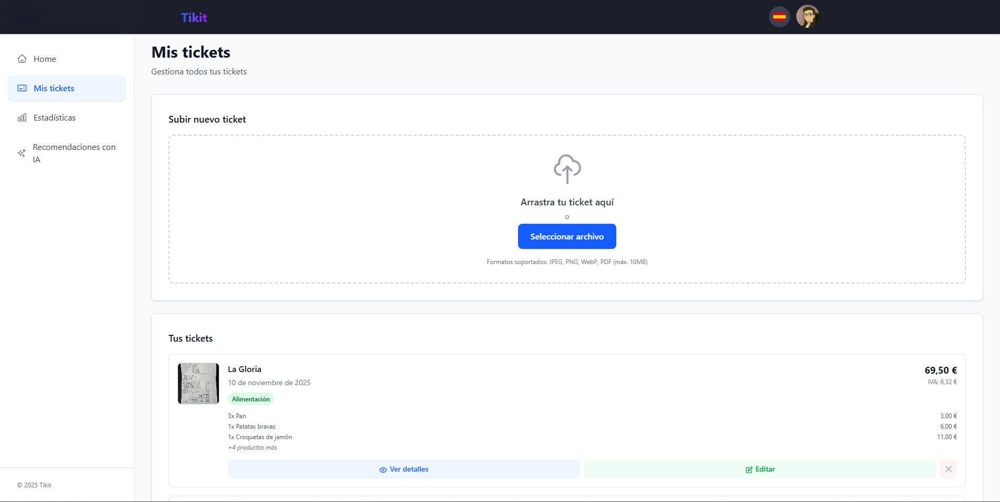
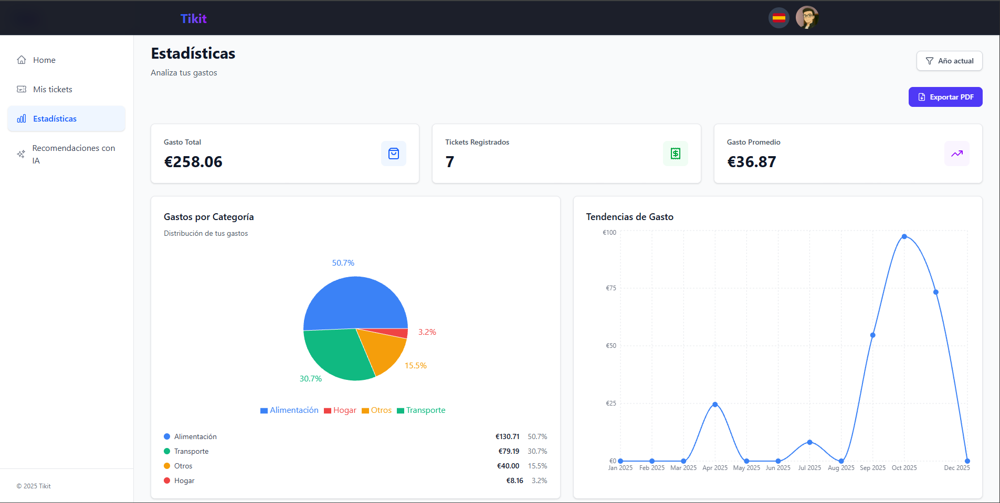

<div align="center">

# Tikit

### Gestión Inteligente de Tickets de Compra

[](https://tikit-drab.vercel.app/es)
[](https://nextjs.org/)
[](https://www.typescriptlang.org/)

[**Ver Demo**](https://tikit-drab.vercel.app/es) • [Reportar Bug](https://github.com/Migu66/Tikit/issues) • [Solicitar Feature](https://github.com/Migu66/Tikit/issues)

</div>

---

## Descripción

**Tikit** es una aplicación web moderna que te permite digitalizar y gestionar tus tickets de compra de forma inteligente. Utiliza OCR y tecnología de IA para extraer información automáticamente, clasificar tus gastos y brindarte estadísticas detalladas sobre tus hábitos de consumo.

## Características Principales

-   **Escaneo Automático**: Sube imágenes de tickets y extrae datos con OCR
-   **Clasificación Inteligente**: IA que categoriza tus compras automáticamente
-   **Estadísticas Detalladas**: Visualiza tus gastos con gráficos interactivos
-   **Búsqueda Avanzada**: Encuentra tickets por fecha, categoría o comercio
-   **Recomendaciones**: Consejos personalizados para optimizar tus gastos
-   **Multiidioma**: Interfaz disponible en español e inglés
-   **Autenticación Segura**: Login con Google o email

## Mis Tickets

Gestiona todos tus tickets de forma visual y organizada. Edita, visualiza o elimina tickets con una interfaz intuitiva.



## Estadísticas

Analiza tus patrones de gasto con gráficos interactivos y obtén insights sobre tu comportamiento financiero.



## Tecnologías

### Frontend

-   **Next.js 16** con App Router
-   **TypeScript** al 100%
-   **Tailwind CSS** para estilos
-   **Tremor** para visualizaciones
-   **GSAP** para animaciones

### Backend

-   **Next.js API Routes**
-   **Prisma ORM**
-   **PostgreSQL** (Neon)
-   **NextAuth** para autenticación

### Servicios

-   **Cloudinary** - Almacenamiento de imágenes
-   **Open AI** - IA para clasificación

## Instalación

```bash
# Clonar el repositorio
git clone https://github.com/Migu66/Tikit.git

# Instalar dependencias
cd Tikit
npm install

# Configurar variables de entorno
cp .env.example .env.local

# Iniciar base de datos local (opcional)
npm run db:start

# Generar cliente de Prisma
npm run db:generate

# Ejecutar en modo desarrollo
npm run dev
```

## Variables de Entorno

```env
DATABASE_URL=
AUTH_SECRET=
CLOUDINARY_CLOUD_NAME=
CLOUDINARY_API_KEY=
CLOUDINARY_API_SECRET=
GOOGLE_CLIENT_ID=
GOOGLE_CLIENT_SECRET=
GITHUB_ID=
GITHUB_SECRET=
GEMINI_API_KEY=
```

## Testing

```bash
# Ejecutar tests
npm test

# Ejecutar tests con UI
npm run test:ui

# Ver cobertura
npm run test:coverage
```

## Scripts Disponibles

| Script              | Descripción                           |
| ------------------- | ------------------------------------- |
| `npm run dev`       | Inicia el servidor de desarrollo      |
| `npm run build`     | Compila la aplicación para producción |
| `npm start`         | Inicia el servidor de producción      |
| `npm test`          | Ejecuta los tests                     |
| `npm run db:studio` | Abre Prisma Studio                    |

## Características Técnicas

-   ✅ **100% TypeScript** - Código type-safe
-   ✅ **Server Components** - Mejor rendimiento
-   ✅ **Responsive Design** - Móvil primero
-   ✅ **SEO Optimizado** - Meta tags dinámicos
-   ✅ **Cobertura de Tests** - +80% del código
-   ✅ **CI/CD** - Despliegue automático

---

<div align="center">

Desarrollado por [Miguel](https://github.com/Migu66)

</div>
